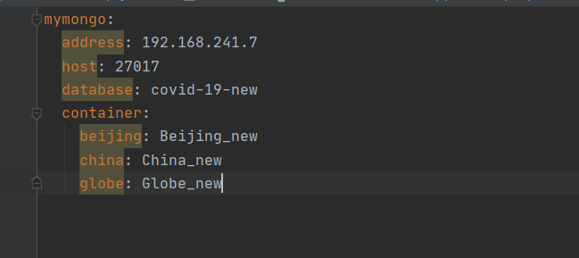

# RequestMapping 列表

| Key              | Value                    |
| ---------------- | ------------------------ |
| IP+端口          | localhost:8080           |
| 首页             | /index                   |
| 获取北京疫情数据 | /data?type=beijing       |
| 获取中国疫情数据 | /data?type=china         |
| 获取世界疫情数据 | /data?type=globe         |
| 获取北京数据界面 | /index/page?type=beijing |
| 获取中国数据界面 | /index/page?type=china   |
| 获取世界数据界面 | /index/page?type=globe   |
| 运行爬虫         | /spider                  |
| 启动 MapReduce   | /mr/runmr                |
| 刷新本地生成数据 | /mr/localfile            |

# ProgressBar 请求列表

| Key                        | Value                                        |
| -------------------------- | -------------------------------------------- |
| 重置 spider 进度条         | /progress/spider/zero                        |
| 获取 spider 进度           | /progress/spider/how                         |
| 提交 spider 完成进度及信息 | /progress/spider/add?add=10&message=正在执行 |


# Day 1

> 总结：完成项目构建

---

# Day 2

完成 Python 端 Thrift 服务的实现

---

# Day 3

## 1.实现了热部署

> 就是支持了热部署，但是部署速度较慢
>
> 无法忍受或者比较着急可以手动按==ctrl+F9==手动快速重构项目
>
> 刷新项目速度：rebuild > auto > rerun

## 2. 实现 resources 的配置

==需要所有操作默认在**user-edge-service**中进行==

### ① 添加 HTML 文件

> 提前告诉我需要加页面这事儿、提供参数列表、提供文件名
>
> 将需要添加的 HTML 页面放进 templates 中


# Day 5

## 1.完成了数据的提供

## ==注意==！ 需要在==user-thrift-service==中添加配置文件

> 文件名：application.yml
>
> 文件内容：
>
> ```yml
> mymongo:
>   address: 192.168.241.7
>   host: 27017
>   database: covid-19-new
>   container:
>     beijing: Beijing_new
>     china: China_new
>     globe: Globe_new
> ```
>
> 截图：
>
> 
>
> 

# Day 6

增加参数：类型控制（为了代码复用，防止一个函数复制粘贴三遍

前端的同学用以下JS语句做==类型==判断

```javascript
var pageType = "[[${type}]]".toLowerCase();
if(pageType == "beijing"){ ... }
else if(pageType == "china"){ ... }
else if(pageType == "globe"){ ... }
else{ console.log("Wrong type") }
```
# Day 7
需要在==config.py==中添加以下代码
```python
def run_spider():
    get_info(ip, db, table1, table2, table3)
```
并删除main函数
