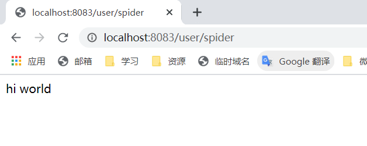
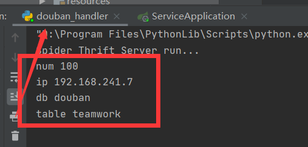
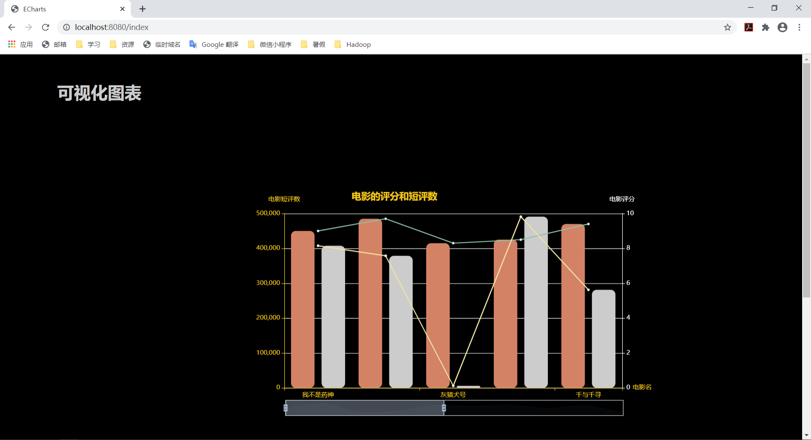

# Day One
## 1.创建文件夹

## 2.设置 git ignore 的约定

> 将个性化的配置文件尽可能的放进 [ignore](..\..\.gitignore) 文件
>
> 注意要提前设置 gitignore 再生成文件，以防止IDEA自动提交新文件至git

## 3.gitignore实例

> douban-thrift-python-service 文件夹下 有一个  douban-thrift-python-service.iml 文件
>
> 因为涉及JDK版本，加进ignore
>
> 代码如下：
> <?xml version="1.0" encoding="UTF-8"?>
> <module type="PYTHON_MODULE" version="4">
>   <component name="NewModuleRootManager" inherit-compiler-output="true">
>     <exclude-output />
>     <content url="file://$MODULE_DIR$" />
>     <orderEntry type="jdk" jdkName="Python 3.7 virtualenv at D:\Program Files\PythonLib" jdkType="Python SDK" />
>     <orderEntry type="sourceFolder" forTests="false" />
>   </component>
> </module>

# Day Five
## 1.设计 thrift 结构 demo

```
1. spider.thrift
service spiderService{

    # run spider

    void getData();
}
2. data.thrift
struct MovieInfo{
    1:string movieName,
    2:double movieStar,
    3:i32 commentNumber
}
service DataService{

    # output data to web

    list<MovieInfo> outputData();
}
```

## 2.文件变动提示

1. 所有 config 文件在 thriftservice 中失效，除非需要本地调试，否则没有设置的必要
   ==并且config.py只有douban文件夹下才能生效==

## 3.关于新增 gitignore 文件

1. douban-thrift-service-api.iml

   > 此文件在 douban-thrift-service-api 下，代码为
   >
   > ```iml
   > <?xml version="1.0" encoding="UTF-8"?>
   > <module org.jetbrains.idea.maven.project.MavenProjectsManager.isMavenModule="true" type="JAVA_MODULE" version="4">
   >   <component name="NewModuleRootManager" LANGUAGE_LEVEL="JDK_1_8">
   >     <output url="file://$MODULE_DIR$/target/classes" />
   >     <output-test url="file://$MODULE_DIR$/target/test-classes" />
   >     <content url="file://$MODULE_DIR$">
   >       <sourceFolder url="file://$MODULE_DIR$/src/main/java" isTestSource="false" />
   >       <excludeFolder url="file://$MODULE_DIR$/target" />
   >     </content>
   >     <orderEntry type="inheritedJdk" />
   >     <orderEntry type="sourceFolder" forTests="false" />
   >     <orderEntry type="library" name="Maven: org.apache.thrift:libthrift:0.13.0" level="project" />
   >     <orderEntry type="library" name="Maven: org.slf4j:slf4j-api:1.7.25" level="project" />
   >     <orderEntry type="library" name="Maven: org.apache.httpcomponents:httpclient:4.5.6" level="project" />
   >     <orderEntry type="library" name="Maven: commons-logging:commons-logging:1.2" level="project" />
   >     <orderEntry type="library" name="Maven: commons-codec:commons-codec:1.10" level="project" />
   >     <orderEntry type="library" name="Maven: org.apache.httpcomponents:httpcore:4.4.1" level="project" />
   >     <orderEntry type="library" name="Maven: javax.annotation:javax.annotation-api:1.3.2" level="project" />
   >   </component>
   > </module>
   > ```

2. user-edge-service.iml

   > 此文件在 user-edge-service 下，代码为
   >
   > ```iml
   > <?xml version="1.0" encoding="UTF-8"?>
   > <module org.jetbrains.idea.maven.project.MavenProjectsManager.isMavenModule="true" type="JAVA_MODULE" version="4">
   >   <component name="FacetManager">
   >     <facet type="Spring" name="Spring">
   >       <configuration />
   >     </facet>
   >     <facet type="web" name="Web">
   >       <configuration>
   >         <webroots />
   >         <sourceRoots>
   >           <root url="file://$MODULE_DIR$/src/main/java" />
   >           <root url="file://$MODULE_DIR$/src/main/resources" />
   >         </sourceRoots>
   >       </configuration>
   >     </facet>
   >   </component>
   >   <component name="NewModuleRootManager" LANGUAGE_LEVEL="JDK_1_8">
   >     <output url="file://$MODULE_DIR$/target/classes" />
   >     <output-test url="file://$MODULE_DIR$/target/test-classes" />
   >     <content url="file://$MODULE_DIR$">
   >       <sourceFolder url="file://$MODULE_DIR$/src/main/java" isTestSource="false" />
   >       <sourceFolder url="file://$MODULE_DIR$/src/main/resources" type="java-resource" />
   >       <sourceFolder url="file://$MODULE_DIR$/src/test/java" isTestSource="true" />
   >       <excludeFolder url="file://$MODULE_DIR$/target" />
   >     </content>
   >     <orderEntry type="inheritedJdk" />
   >     <orderEntry type="sourceFolder" forTests="false" />
   >     <orderEntry type="library" name="Maven: org.springframework.boot:spring-boot-starter-web:2.3.1.RELEASE" level="project" />
   >     <orderEntry type="library" name="Maven: org.springframework.boot:spring-boot-starter:2.3.1.RELEASE" level="project" />
   >     <orderEntry type="library" name="Maven: org.springframework.boot:spring-boot:2.3.1.RELEASE" level="project" />
   >     <orderEntry type="library" name="Maven: org.springframework.boot:spring-boot-autoconfigure:2.3.1.RELEASE" level="project" />
   >     <orderEntry type="library" name="Maven: org.springframework.boot:spring-boot-starter-logging:2.3.1.RELEASE" level="project" />
   >     <orderEntry type="library" name="Maven: ch.qos.logback:logback-classic:1.2.3" level="project" />
   >     <orderEntry type="library" name="Maven: ch.qos.logback:logback-core:1.2.3" level="project" />
   >     <orderEntry type="library" name="Maven: org.apache.logging.log4j:log4j-to-slf4j:2.13.3" level="project" />
   >     <orderEntry type="library" name="Maven: org.apache.logging.log4j:log4j-api:2.13.3" level="project" />
   >     <orderEntry type="library" name="Maven: org.slf4j:jul-to-slf4j:1.7.30" level="project" />
   >     <orderEntry type="library" name="Maven: jakarta.annotation:jakarta.annotation-api:1.3.5" level="project" />
   >     <orderEntry type="library" name="Maven: org.yaml:snakeyaml:1.26" level="project" />
   >     <orderEntry type="library" name="Maven: org.springframework.boot:spring-boot-starter-json:2.3.1.RELEASE" level="project" />
   >     <orderEntry type="library" name="Maven: com.fasterxml.jackson.core:jackson-databind:2.11.0" level="project" />
   >     <orderEntry type="library" name="Maven: com.fasterxml.jackson.core:jackson-annotations:2.11.0" level="project" />
   >     <orderEntry type="library" name="Maven: com.fasterxml.jackson.core:jackson-core:2.11.0" level="project" />
   >     <orderEntry type="library" name="Maven: com.fasterxml.jackson.datatype:jackson-datatype-jdk8:2.11.0" level="project" />
   >     <orderEntry type="library" name="Maven: com.fasterxml.jackson.datatype:jackson-datatype-jsr310:2.11.0" level="project" />
   >     <orderEntry type="library" name="Maven: com.fasterxml.jackson.module:jackson-module-parameter-names:2.11.0" level="project" />
   >     <orderEntry type="library" name="Maven: org.springframework.boot:spring-boot-starter-tomcat:2.3.1.RELEASE" level="project" />
   >     <orderEntry type="library" name="Maven: org.apache.tomcat.embed:tomcat-embed-core:9.0.36" level="project" />
   >     <orderEntry type="library" name="Maven: org.glassfish:jakarta.el:3.0.3" level="project" />
   >     <orderEntry type="library" name="Maven: org.apache.tomcat.embed:tomcat-embed-websocket:9.0.36" level="project" />
   >     <orderEntry type="library" name="Maven: org.springframework:spring-web:5.2.7.RELEASE" level="project" />
   >     <orderEntry type="library" name="Maven: org.springframework:spring-beans:5.2.7.RELEASE" level="project" />
   >     <orderEntry type="library" name="Maven: org.springframework:spring-webmvc:5.2.7.RELEASE" level="project" />
   >     <orderEntry type="library" name="Maven: org.springframework:spring-context:5.2.7.RELEASE" level="project" />
   >     <orderEntry type="library" name="Maven: org.springframework:spring-expression:5.2.7.RELEASE" level="project" />
   >     <orderEntry type="library" name="Maven: org.springframework.boot:spring-boot-starter-thymeleaf:2.3.1.RELEASE" level="project" />
   >     <orderEntry type="library" name="Maven: org.thymeleaf:thymeleaf-spring5:3.0.11.RELEASE" level="project" />
   >     <orderEntry type="library" name="Maven: org.thymeleaf:thymeleaf:3.0.11.RELEASE" level="project" />
   >     <orderEntry type="library" name="Maven: org.attoparser:attoparser:2.0.5.RELEASE" level="project" />
   >     <orderEntry type="library" name="Maven: org.unbescape:unbescape:1.1.6.RELEASE" level="project" />
   >     <orderEntry type="library" name="Maven: org.thymeleaf.extras:thymeleaf-extras-java8time:3.0.4.RELEASE" level="project" />
   >     <orderEntry type="library" name="Maven: org.apache.thrift:libthrift:0.13.0" level="project" />
   >     <orderEntry type="library" name="Maven: org.slf4j:slf4j-api:1.7.30" level="project" />
   >     <orderEntry type="library" name="Maven: org.apache.httpcomponents:httpclient:4.5.12" level="project" />
   >     <orderEntry type="library" name="Maven: commons-codec:commons-codec:1.14" level="project" />
   >     <orderEntry type="library" name="Maven: org.apache.httpcomponents:httpcore:4.4.13" level="project" />
   >     <orderEntry type="library" name="Maven: javax.annotation:javax.annotation-api:1.3.2" level="project" />
   >     <orderEntry type="module" module-name="douban-thrift-service-api" />
   >     <orderEntry type="library" name="Maven: org.springframework.data:spring-data-redis:2.3.1.RELEASE" level="project" />
   >     <orderEntry type="library" name="Maven: org.springframework.data:spring-data-keyvalue:2.3.1.RELEASE" level="project" />
   >     <orderEntry type="library" name="Maven: org.springframework.data:spring-data-commons:2.3.1.RELEASE" level="project" />
   >     <orderEntry type="library" name="Maven: org.springframework:spring-tx:5.2.7.RELEASE" level="project" />
   >     <orderEntry type="library" name="Maven: org.springframework:spring-oxm:5.2.7.RELEASE" level="project" />
   >     <orderEntry type="library" name="Maven: org.springframework:spring-aop:5.2.7.RELEASE" level="project" />
   >     <orderEntry type="library" name="Maven: org.springframework:spring-context-support:5.2.7.RELEASE" level="project" />
   >     <orderEntry type="library" name="Maven: io.lettuce:lettuce-core:5.3.1.RELEASE" level="project" />
   >     <orderEntry type="library" name="Maven: io.netty:netty-common:4.1.50.Final" level="project" />
   >     <orderEntry type="library" name="Maven: io.netty:netty-handler:4.1.50.Final" level="project" />
   >     <orderEntry type="library" name="Maven: io.netty:netty-resolver:4.1.50.Final" level="project" />
   >     <orderEntry type="library" name="Maven: io.netty:netty-buffer:4.1.50.Final" level="project" />
   >     <orderEntry type="library" name="Maven: io.netty:netty-codec:4.1.50.Final" level="project" />
   >     <orderEntry type="library" name="Maven: io.netty:netty-transport:4.1.50.Final" level="project" />
   >     <orderEntry type="library" name="Maven: io.projectreactor:reactor-core:3.3.6.RELEASE" level="project" />
   >     <orderEntry type="library" name="Maven: org.reactivestreams:reactive-streams:1.0.3" level="project" />
   >     <orderEntry type="library" name="Maven: org.apache.commons:commons-pool2:2.8.0" level="project" />
   >     <orderEntry type="library" name="Maven: commons-lang:commons-lang:2.6" level="project" />
   >     <orderEntry type="library" scope="TEST" name="Maven: org.springframework.boot:spring-boot-starter-test:2.3.1.RELEASE" level="project" />
   >     <orderEntry type="library" scope="TEST" name="Maven: org.springframework.boot:spring-boot-test:2.3.1.RELEASE" level="project" />
   >     <orderEntry type="library" scope="TEST" name="Maven: org.springframework.boot:spring-boot-test-autoconfigure:2.3.1.RELEASE" level="project" />
   >     <orderEntry type="library" scope="TEST" name="Maven: com.jayway.jsonpath:json-path:2.4.0" level="project" />
   >     <orderEntry type="library" scope="TEST" name="Maven: net.minidev:json-smart:2.3" level="project" />
   >     <orderEntry type="library" scope="TEST" name="Maven: net.minidev:accessors-smart:1.2" level="project" />
   >     <orderEntry type="library" scope="TEST" name="Maven: org.ow2.asm:asm:5.0.4" level="project" />
   >     <orderEntry type="library" scope="TEST" name="Maven: jakarta.xml.bind:jakarta.xml.bind-api:2.3.3" level="project" />
   >     <orderEntry type="library" scope="TEST" name="Maven: jakarta.activation:jakarta.activation-api:1.2.2" level="project" />
   >     <orderEntry type="library" scope="TEST" name="Maven: org.assertj:assertj-core:3.16.1" level="project" />
   >     <orderEntry type="library" scope="TEST" name="Maven: org.hamcrest:hamcrest:2.2" level="project" />
   >     <orderEntry type="library" scope="TEST" name="Maven: org.junit.jupiter:junit-jupiter:5.6.2" level="project" />
   >     <orderEntry type="library" scope="TEST" name="Maven: org.junit.jupiter:junit-jupiter-api:5.6.2" level="project" />
   >     <orderEntry type="library" scope="TEST" name="Maven: org.apiguardian:apiguardian-api:1.1.0" level="project" />
   >     <orderEntry type="library" scope="TEST" name="Maven: org.opentest4j:opentest4j:1.2.0" level="project" />
   >     <orderEntry type="library" scope="TEST" name="Maven: org.junit.platform:junit-platform-commons:1.6.2" level="project" />
   >     <orderEntry type="library" scope="TEST" name="Maven: org.junit.jupiter:junit-jupiter-params:5.6.2" level="project" />
   >     <orderEntry type="library" scope="TEST" name="Maven: org.junit.jupiter:junit-jupiter-engine:5.6.2" level="project" />
   >     <orderEntry type="library" scope="TEST" name="Maven: org.junit.platform:junit-platform-engine:1.6.2" level="project" />
   >     <orderEntry type="library" scope="TEST" name="Maven: org.mockito:mockito-core:3.3.3" level="project" />
   >     <orderEntry type="library" scope="TEST" name="Maven: net.bytebuddy:byte-buddy:1.10.11" level="project" />
   >     <orderEntry type="library" scope="TEST" name="Maven: net.bytebuddy:byte-buddy-agent:1.10.11" level="project" />
   >     <orderEntry type="library" scope="TEST" name="Maven: org.objenesis:objenesis:2.6" level="project" />
   >     <orderEntry type="library" scope="TEST" name="Maven: org.mockito:mockito-junit-jupiter:3.3.3" level="project" />
   >     <orderEntry type="library" scope="TEST" name="Maven: org.skyscreamer:jsonassert:1.5.0" level="project" />
   >     <orderEntry type="library" scope="TEST" name="Maven: com.vaadin.external.google:android-json:0.0.20131108.vaadin1" level="project" />
   >     <orderEntry type="library" name="Maven: org.springframework:spring-core:5.2.7.RELEASE" level="project" />
   >     <orderEntry type="library" name="Maven: org.springframework:spring-jcl:5.2.7.RELEASE" level="project" />
   >     <orderEntry type="library" scope="TEST" name="Maven: org.springframework:spring-test:5.2.7.RELEASE" level="project" />
   >     <orderEntry type="library" scope="TEST" name="Maven: org.xmlunit:xmlunit-core:2.7.0" level="project" />
   >   </component>
   > </module>
   > ```

## 4.程序试运行

1. run douban_handler.py
2. run ServiceApplication
3. 浏览器输入 ``http://localhost:8083/user/spider``
4. 
5. 
6. 这样的效果说明目前一切顺利，爬虫函数还未调试，因为本地环境有密码


# Day Six

## 1.需要做的配置

1. user-edge-service中的application.properties

   > ```properties
   > douban.ip = 192.168.241.7
   > spring.data.mongodb.uri = mongodb://admin:@192.168.241.7:27017/douban
   > ```
   >
   > 这两项里面的ip地址换成自己的

## 2.开启服务

1. user-edge-service中的==ServiceApplication==
2. douban-thrift-python-service中的==douban_handler.py==
3. data-thrift-service中的==ApplicationService==

## 3.RequestMapping列表

> 前缀	localhost:8080

> /user/movie	---	返回一个本地电影信息的 JSON 数据
>
> /user/movielist	---	返回**虚拟机**中 mongodb 中 **douban** 数据库中 **teamwork** 表中的所有电影信息的 JSON 数据

> /spider	---	爬取数据并存储至**虚拟机**中 mongodb 中 **douban** 数据库中 **teamwork** 表中

> /index	---	显示数据展示页面

## 4.实例

开启三个服务之后，输入

> http://localhost:8080/index



