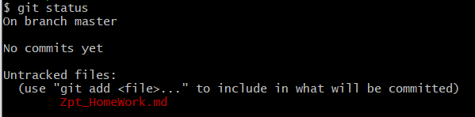
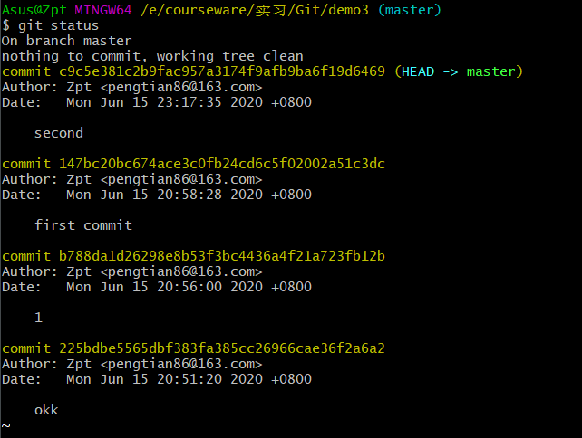
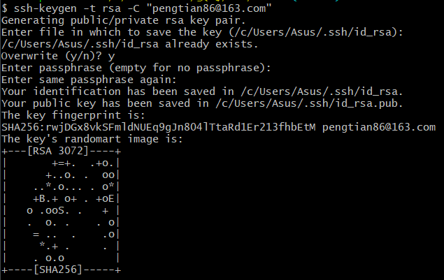

# 一、Git

## 一.基本语句

1. git init
   初始化文件夹git环境
2. git status
   查看当前变更
   
3. git add "Zpt_HomeWork.md"
   将变更提交到暂存区，此操作会清空工作区
4. git commit -m "备注"
   将暂存区的变更提交到分支，此操作会清空暂存区
5. clear
   清空git bash页面
6. git reset HEAD "Zpt_HomeWork"
   将暂存区的修改回滚到工作区，此后便可get status看到记录
7. git checkout "Zpt_HomeWork"
   将工作区暂存的记录重置到本地，完成回滚
8. git log
   查看提交记录
   
9. git reset --hard {{commit}}
   即可回滚到对应的commit
10. git rm bash_demo.txt
    删除本地的文件
    还需要再commit才能清除远程分支
11. ssh-keygen -t rsa -C "pengtian86@163.com"
    获取ssh密钥
    
    密钥会存在用户文件夹下，可以通过``cd ~``来回到用户文件夹下，再输入``cd .ssh/``即可进入ssh文件夹，其中的id_res.pub是公钥，读取之后便获取了ssh密钥
    ssh -T git@github.com 可以查看密钥状态

