# 一、Git

## 1.基本语句

1. git init
   初始化文件夹git环境
2. git status
   查看当前变更
   
3. git add "Zpt_HomeWork.md"
   将变更提交到暂存区，此操作会清空工作区
4. git commit -m "备注"
   将暂存区的变更提交到分支，此操作会清空暂存区
5. clear
   清空git bash页面
6. git reset HEAD "Zpt_HomeWork"
   将暂存区的修改回滚到工作区，此后便可get status看到记录
7. git checkout "Zpt_HomeWork"
   将工作区暂存的记录重置到本地，完成回滚
8. git log
   查看提交记录
   
9. git reset --hard ``commit``
   即可回滚到对应的commit
10. git rm bash_demo.txt
    删除本地的文件
    还需要再commit才能清除远程分支
11. ssh-keygen -t rsa -C "pengtian86@163.com"
    获取ssh密钥
    
    密钥会存在用户文件夹下，可以通过``cd ~``来回到用户文件夹下，再输入``cd .ssh/``即可进入ssh文件夹，其中的id_res.pub是公钥，读取之后便获取了ssh密钥
    ssh -T git@github.com 可以查看密钥状态
12. git remote -v
    查看远程仓库
13. git remote add ``name`` ``url``
    添加远程仓库
14. git push
15. **git** clone ``url``
    需要提前查看文件夹下是否有git文件夹``ls -a``
    ``echo "clone demo" >> clone.txt``用于在clone.txt中追加一句"clone demo"
16. git tag 
    查看所有标签
17. git tag tagname
    设置tag名称
18. git tag -a tagname -m "comment"
    指定提交信息
19. git tag -d tagname
    删除标签
20. git push origin tagname
    标签发表

------------

# 二、虚拟机

## 1.安装

1. 下载centOS 6

2. 下载并安装VMware workstation，序列码FC7D0-D1YDL-M8DXZ-CYPZE-P2AY6

3. 新建centOS 6虚拟机

4. 设置有两点很重要，不然可能会报==operating system not found==
   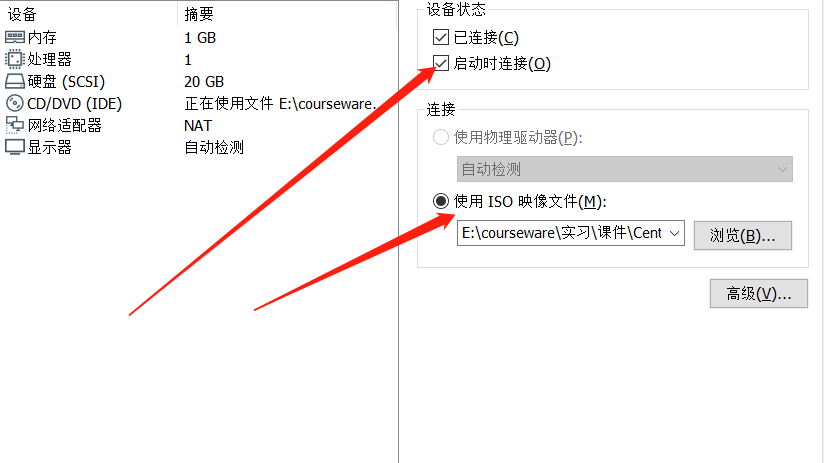

5. 获取root权限

   ```
   su
   cd /etc
   chomd 740 sudoers
   gedit sudoers
   
   在打开的文件最后加入
   用户名   ALL=(ALL:ALL) ALL
   ```

6. 安装vmware-install.pl
   
   
7. 设置共享文件夹

8. 在``/mnt/hgfs/share``中打开共享文件夹

9. 文件夹作用

   ```
   /bin：是Binary的缩写，这个目录存放着系统必备执行命令
   
   /boot：这里存放的是启动Linux时使用的一些核心文件，包括一些连接文件以及镜像文件，自己的安装别放这里
   
   /dev：Device(设备)的缩写，该目录下存放的是Linux的外部设备，在Linux中访问设备的方式和访问文件的方式是相同的。
   
   /etc：所有的系统管理所需要的配置文件和子目录。
   
   /home：存放普通用户的主目录，在Linux中每个用户都有一个自己的目录，一般该目录名是以用户的账号命名的。
   
   /lib：系统开机所需要最基本的动态连接共享库，其作用类似于Windows里的DLL文件。几乎所有的应用程序都需要用到这些共享库。
   
   /lost+found：这个目录一般情况下是空的，当系统非法关机后，这里就存放了一些文件。
   
   /media：linux系统会自动识别一些设备，例如U盘、光驱等等，当识别后，linux会把识别的设备挂载到这个目录下。
   
   /misc: 该目录可以用来存放杂项文件或目录，即那些用途或含义不明确的文件或目录可以存放在该目录下。
   
   /mnt：系统提供该目录是为了让用户临时挂载别的文件系统的，我们可以将光驱挂载在/mnt/上，然后进入该目录就可以查看光驱里的内容了。
   
   /net  存放着和网络相关的一些文件.
   
   /opt：这是给主机额外安装软件所摆放的目录。比如你安装一个ORACLE数据库则就可以放到这个目录下。默认是空的。
   
   /proc：这个目录是一个虚拟的目录，它是系统内存的映射，我们可以通过直接访问这个目录来获取系统信息。
   
   /root：该目录为系统管理员，也称作超级权限者的用户主目录。
   
   /sbin：s就是Super User的意思，这里存放的是系统管理员使用的系统管理程序。
   
   /selinux：这个目录是Redhat/CentOS所特有的目录，Selinux是一个安全机制，类似于windows的防火墙
   
   /srv：service缩写，该目录存放一些服务启动之后需要提取的数据。
   
   /sys： 这是linux2.6内核的一个很大的变化。该目录下安装了2.6内核中新出现的一个文件系统 sysfs 。
   
   /tmp：这个目录是用来存放一些临时文件的。
   
   /usr： 这是一个非常重要的目录，用户的很多应用程序和文件都放在这个目录下，类似与windows下的program files目录。
   
   /var：这个目录中存放着在不断扩充着的东西，我们习惯将那些经常被修改的目录放在这个目录下。包括各种日志文件。
   ```

## 2.VI/VIM编辑器

1. 常用语法

   ```
   1）yy            （功能描述：复制光标当前一行）
      y数字y     （功能描述：复制一段(从第几行到第几行)）
   2）p              （功能描述：箭头移动到目的行粘贴）
   3）u              （功能描述：撤销上一步）
   4）dd            （功能描述：删除光标当前行）
   d数字d     （功能描述：删除光标(含)后多少行）
   5）x              （功能描述：删除一个字母，相当于del）
      X             （功能描述：删除一个字母，相当于Backspace）
   6）yw           （功能描述：复制一个词）
   7）dw           （功能描述：删除一个词）
   8）shift+^      （功能描述：移动到行头）
   9）shift+$     （功能描述：移动到行尾）
   10）1+shift+g               （功能描述：移动到页头，数字）
   11）shift+g                  （功能描述：移动到页尾）
   12）数字N+shift+g      （功能描述：移动到目标行）
   ```

2. 编辑模式
   i ->当前光标前
   a->当前光标后
   o->当前光标下一行
   esc->退出编辑模式
   : -> 指令模式
   w->保存
   q->退出
   !->强制执行

## 3.Linux文件系统命令

1. ctrl + l
   清屏
2. pwd
   显示当前绝对路径
3. ls
   -a 全部文件
   -l 长数据传列出、包括权限属性
4. rmdir
   删除空的目录
5. touch  ``name``
   创建空文件
6. cp a b
   复制a到b
   cp -r dira dirb
   递归复制dira到dirb
7. rmdir 删除空目录
   rm -rf file 递归删除所有
8. mv a b
   移动a到b
9. cat
   查看内容
   tac
   最后一行开始查看
10. more & less
    查看文件内容
11. head -n 10 text
    查看开头十行
    tail -n 10 text
    查看结尾十行
12. su root
    切换用户至root

## 4.RMP

1. rmp -qa
   查询所有rmp软件包
2. rmp -e rmp软件包
   卸载
3. rmo -ivh rmp软件包
   -i=install，安装

​       -v=verbose，显示详细信息	

​       -h=hash，进度条

## 5.YUM

1. yum install -y httpd               （功能描述：安装httpd并确认安装）
2. yum list                              （功能描述：列出所有可用的package和package组）
3. yum clean all                       （功能描述：清除所有缓冲数据）

4. yum deplist httpd                 （功能描述：列出一个包所有依赖的包）

5. yum remove httpd                （功能描述：删除httpd）
   

## 6.安装mysql

1. 将mysql压缩包放于共享文件夹中，进行解压

   ```shell
   tar -zxvf mysql-5.7....tar.gz
   ```

2. 移动解压文件夹并重命名

    ```shell
   mv mysql-5.7... /usr/local/mysql
   ```

3. 

## 7.安装jdk

1. 搜索jdk

   ```shell
   yum -y list java*
   ```

   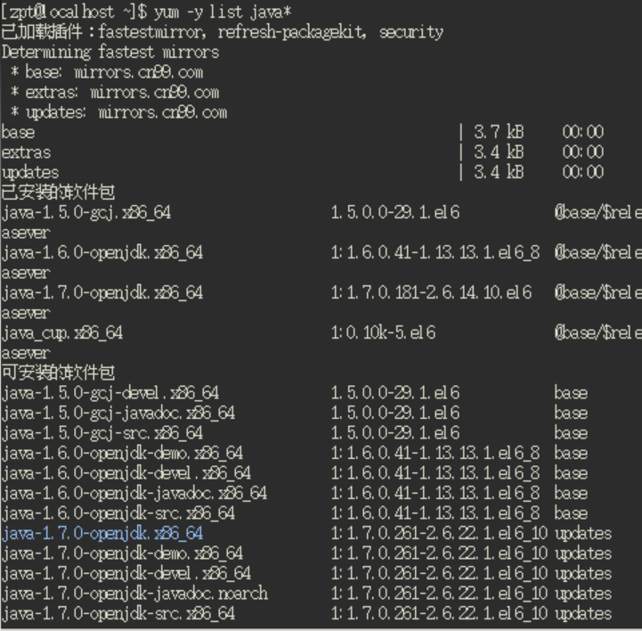

2. 下载对应版本

   ```
   yum -y install 
   ```

   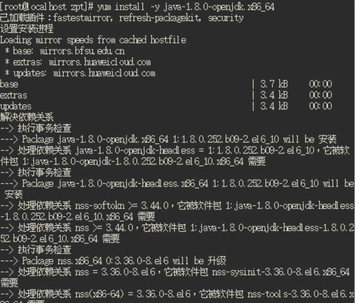
   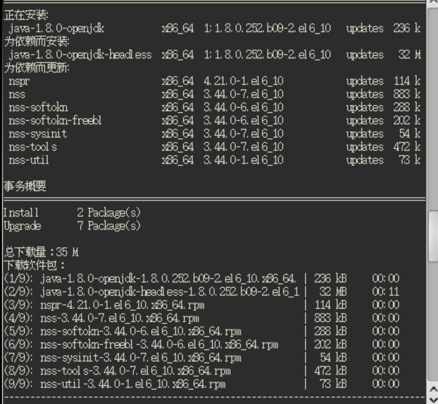

3. 导出jar包
   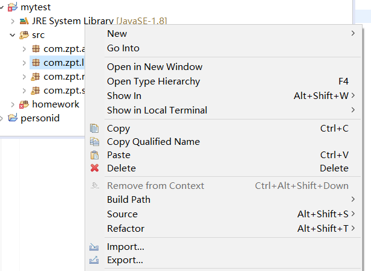
   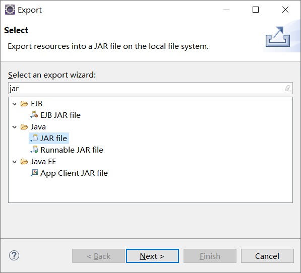
   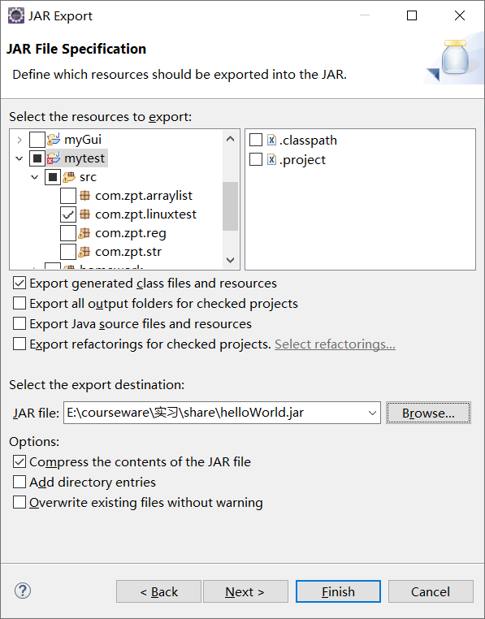

   ==如果不设置Main class会导致jar中没有主清单属性==
   
4. 拷贝jar包至share文件夹并运行

   ```shell
   java -jar helloWorld.jar
   ```

   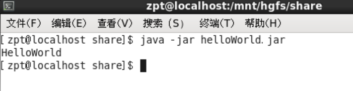

## 8.配置IP地址

1. 用``ifconfig``查看网络配置
   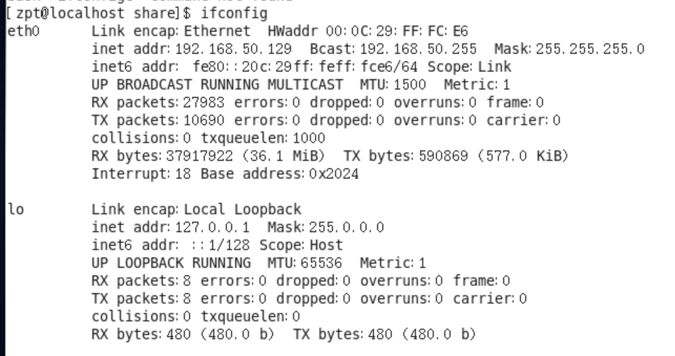

------------

# 三、Python

## 第二章、变量

### ①字符串

1. title()
   首字母大小
2. lower()/upper()
   大小写转换
3. str1 + str2
   合并
4. rstrip()
   删除空白
5. replace(a,b)
   将a换为b

#### ②数字

1. ``3 ** 2``
   平方运算，得9
2. str(int)
   int -> string

## 第三章、列表

### ①原则

1. 索引从0开始
2. 索引为-1代表最后一个元素

### ②方法

1. append(item)
   增加item
2. insert(index,item)
   在index处插入item，其他元素后移
3. del(list[index])
   删除list中index处的元素
4. pop(index)
   弹出index处的元素，默认队尾
5. sort()
   排序，可以有参数reverse，无返回值
6. sorted()
   与sort相同，但是是以返回值的形式
7. reverse()
   倒转列表
8. len(list)
   获取list长度

## 第四章、操作列表

1. 遍历
   ``for item in list:``

2. ``range(a,b,len)``
    a -> b,不包含b,步长为len
3. min(list)、max(list)、sum(list)
4. list[a,b]
   list中第a到b个元素，不包含b，a默认为开头，b默认为结尾，负数同样适用
5. ==列表复制要用切片方法，不然会捆绑连接==

## 第五章、If

1. 判断关键词

   ```
   ==
   !=
   >=
   <=
   and
   or
   in
   not in
   ```

## 第六章、字典

### ①方法

1. del dic['key']
   删除键值对
2. 遍历
   ``for key,value in dic:``
3. keys()
   获取所有key
4. values()
   获取所有value
5. set(list)
   将list转变为集合（去除重复元素）

## 第七章、输入和循环

### ①输入

1. ``message = input("please input something")``
2. int(input())
   可以将输入的数字转为int

## 第八章、函数

### ①参数传递

1. ``def function():``
   定义函数
2. ``def function(item = "default"):``
   默认参数
3. ``def function(list[:]):``
   传递列表副本
4. ``def function(*list):``
   可接受任意数量参数

## 第九章、类

### ①创建

```python
class myclass():	//定义类
	def __init__(self):	//构造函数，self相当于this
        
class sonclass(myclsaa):
    def __init__(self):
        super.__init__()
```

## 第十章、文件与异常

### ①读取文件

1. open(filename)

   ```python
   with open('demo.txt') as demo
   for line in demo:
       print(line.rstrip()) #除去末尾换行
   lines = demo.readlines()
   demo.close()
   ```

### ②写入文件

1. with open(dilename,'w') as demo
   demo.write("hello")

2. 第二个实参：

   ```
   r	读取
   w	写入
   a	附加
   r+	可读可写
   ```

### ③异常

```python
try:
    #执行语句
except Exception:
    #出现异常
else:
    #没有异常
```

1. ``pass``语句
   在except中可以什么都不做
2. json.dump(object,file)
   将object存入file中
3. json.load(file)

## 第十一章、测试函数

### ①单元测试

1. 导入模块unittest
   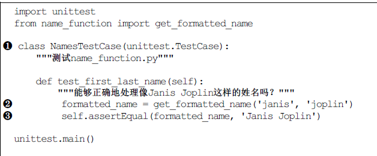

# 四、外星人入侵

## 1.飞船

成果图：
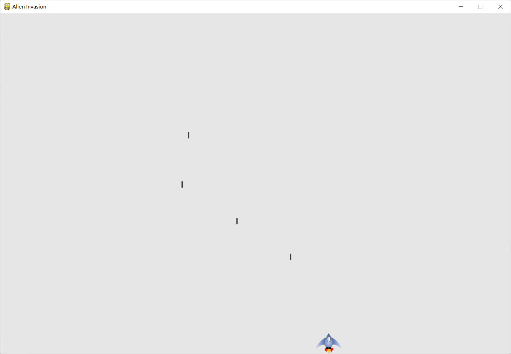